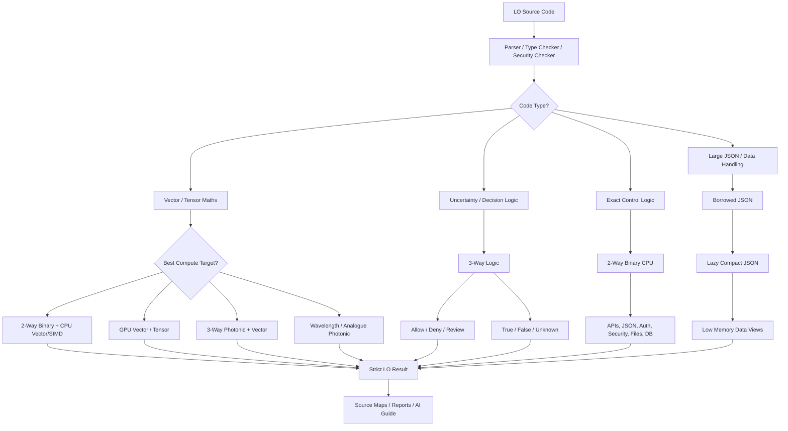

# LO / Logic Omni - Development Stage

**LO**, short for **Logic Omni**, is an open-source project freely available to use under the Apache 2.0 license.

Why LO? To offer a backend syntax that is easy to use for humans and easy to understand for AI, while focusing on photonic logic while being backwards compatible with normal binary compute.

Logic Omni is strict, memory-safe, security-first programming language concept designed to compile one source project into multiple target outputs.

LO is designed for normal binary CPU builds today, while preparing for future
accelerator targets such as GPU, WebAssembly, photonic compute, ternary /
3-way logic systems and wavelength-based analogue compute.

---

## Current Status

LO is currently a language-design and v0.1 prototype project.

This repository includes a small Node.js prototype CLI in `compiler/LO.js`.
The prototype can parse and check the documented LO subset, run simple `.lo`
files, generate development reports, and emit placeholder build artefacts with
source maps, security reports, target reports, memory reports, generated docs
and AI-readable context.

Implemented prototype commands include:

```bash
npm run check
npm test
npm run build:examples
npm run verify -- build/examples
npm run generate:dev
npm run dev
node compiler/LO.js run examples/hello.lo --generate
```

The prototype is not a production compiler. GPU, photonic, ternary and
Omni-logic outputs are planning, simulation or compatibility-report artefacts
unless a future real backend is added. CPU-compatible checked execution remains
the practical baseline.

Feature status labels are defined in `docs/feature-status.md` so implemented,
prototype, draft, planned and research work is not confused.

---

## Summary

LO is a future-facing programming language concept for secure, API-heavy, JSON-native, maths-oriented and accelerator-aware software.

The language is designed to be:

- Strictly typed
- Memory safe
- Security-first by default
- AI-friendly
- JSON-native
- API-native
- Maths-oriented
- Backwards compatible with normal binary CPU systems
- Suitable for short scripts and larger applications built with explicit packages
- Able to compile one source project into multiple target outputs

The core build idea:

```text
.lo source project
   ├── CPU binary output
   ├── WebAssembly output
   ├── GPU execution plan
   ├── photonic execution plan
   ├── ternary simulation output
   ├── source maps
   ├── security reports
   ├── target reports
   └── AI-readable compiler reports
```

LO should be useful before photonic hardware is widely available.

Photonic and ternary support should begin as compiler plans, simulations and target checks. Normal CPU binary output, WebAssembly, GPU planning, API support and JSON processing should provide practical value from the start.

---

## Omni-Logic Direction

LO starts with strong support for binary and ternary logic, but the language should not be limited to only 3-way logic.

The long-term design goal is Omni-logic compatibility, aLOwing future logic widths such as 4-state, 5-state or configurable n-state systems where supported by the compiler, runtime or target backend.

Detailed planning lives in `OMNI_LOGIC.md`, `docs/omni-logic.md`, `docs/logic-widths.md` and `docs/logic-targets.md`.

---

## Core Concept

LO is not trying to prove that photonic hardware can do maths that normal languages cannot describe.

Languages such as C++, Rust, Python, Ruby, JavaScript, TypeScript, Go and C# can already describe almost any calculation.

The real opportunity is different:

> LO should let developers write safe, strict, readable code once, then compile and validate it for different compute targets.

Example:

```text
Payment logic          → CPU binary
Web dashboard logic    → WebAssembly
Fraud model maths      → GPU / future photonic accelerator
Risk decision          → ternary / 3-way decision logic
Error recovery         → secure rollback runtime
API/webhook handling   → CPU runtime with JSON-native validation
```

---

## Project Aim

The main aim of LO is:

> To create a memory-safe, strict-typed, security-first language for modern API systems, AI workflows, maths-heavy processing and future accelerator hardware.

LO should feel safer than JavaScript or PHP, easier to approach than low-level systems programming, and more hardware-aware than traditional web-focused languages.

---

## Why LO?

Modern applications increasingly depend on:

- REST APIs
- Webhooks
- JSON payloads
- AI model calls
- Risk decisions
- Data pipelines
- Concurrent workers
- External services
- Secure configuration
- Multi-server deployment
- CPU, GPU and accelerator workloads

Many current languages can handle these areas, but often through large frameworks, external libraries or runtime conventions.

LO aims to make these concerns first-class.

---

## Key Design Principles

LO should foLOw these principles:

```text
No undefined.
No silent null.
No hidden errors.
No unsafe memory by default.
No accidental truthy/falsy logic.
No implicit type coercion.
No compiled secrets.
No unreported target fallback.
No runtime error without original source mapping.
```

The language should favour clarity over cleverness.

---

## Why LO Uses `flow`

LO uses the keyword `flow` instead of `function`, `def` or `fn`.

A `flow` is LO's version of a function, but with extra meaning.

A normal function usually means:

```text
a named block of code
takes input
returns output
```

A LO flow means:

```text
a named, checkable unit of behaviour
takes typed input
returns typed output
can declare effects
can be marked secure
can be marked pure
can be optimised
can be source-mapped
can appear in reports
can be explained to AI tools
can be used as an API or webhook handler
```

LO uses `flow` because the language is designed around:

```text
API flows
secure flows
pure flows
vector flows
compute flows
rollback-safe flows
AI-readable reports
source-mapped debugging
multi-target compilation
```

Example:

```LO
pure flow calculateVat(subtotal: Decimal) -> Decimal {
  return subtotal * 0.20
}
```

Example secure API handler:

```LO
secure flow createOrder(req: Request) -> Result<Response, ApiError>
effects [network.inbound, database.write] {
  ...
}
```

Example vector-friendly analysis flow:

```LO
pure vector flow analyseCustomersFast(rows: Array<CustomerDumpRow>) -> CustomerAnalysisResult {
  ...
}
```

So in LO:

```text
flow = function + typed behaviour + compiler/report/security awareness
```

---

## What `pure` Means

`pure` means a flow has no side effects.

A pure flow should always return the same output for the same input.

A pure flow must not:

```text
call an external API
read or write files
read or write a database
read the current time
generate random values
change global state
depend on hidden external state
log secrets
```

Example:

```LO
pure flow calculateVat(subtotal: Decimal) -> Decimal {
  return subtotal * 0.20
}
```

If `subtotal` is `140.00`, the result should always be `28.00`.

That makes the flow safe for compiler optimisation.

LO can potentially:

```text
cache pure flows
run pure flows in parallel
vectorise pure flows
move pure vector flows to GPU
plan pure compute blocks for photonic or wavelength targets
test pure flows more easily
include pure flow summaries in AI reports
```

Example non-pure flow:

```LO
flow saveOrder(order: Order) -> Result<Order, Error>
effects [database.write] {
  database.save(order)
}
```

This is not pure because it writes to a database.

Example pure vector flow:

```LO
pure vector flow analyseCustomersFast(rows: Array<CustomerDumpRow>) -> CustomerAnalysisResult {
  let columns = vectorize rows {
    spend = .spend
    orders = .orders
    refunds = .refunds
  }

  let totalSpend = vector.sum(columns.spend)
  let averageSpend = totalSpend / rows.length()

  return CustomerAnalysisResult {
    rowCount: rows.length()
    totalSpend: totalSpend
    averageSpend: averageSpend
  }
}
```

This is pure because it only analyses the input data and returns a result.

It is vector-friendly because it uses `vectorize`.

Recommended LO rule:

```text
Use `flow` for named behaviour.
Use `pure flow` for deterministic calculations.
Use `secure flow` for security-sensitive behaviour.
Use `pure vector flow` for deterministic dataset/vector analysis.
```

---

## File Extension

LO source files use:

```text
.lo
```

Examples:

```text
boot.lo
main.lo
order-service.lo
fraud-check.lo
payment-webhook.lo
```

The recommended project entry file is:

```text
boot.lo
```

For simple projects, `main.lo` is also acceptable.

---

## Example Short Script

```text
hello-world/
└── hello.lo
```

Run:

```bash
LO run hello.lo
```

Example:

```LO
secure flow main() -> Result<Void, Error> {
  print("hello from LO")
  return Ok()
}
```

Short scripts should use secure defaults:

```text
strict types on
memory safety on
undefined denied
null denied
unsafe denied
source maps enabled
CPU target enabled
```

---

## Example Project Structure

Recommended full project structure:

```text
LO-project/
├── README.md
├── ABOUT.md
├── CONCEPT.md
├── LICENSE
├── LICENCE.md
├── NOTICE.md
├── REQUIREMENTS.md
├── DESIGN.md
├── TASKS.md
├── TODO.md
├── ROADMAP.md
├── ARCHITECTURE.md
├── SECURITY.md
├── CONTRIBUTING.md
├── CODE_OF_CONDUCT.md
├── AI-INSTRUCTIONS.md
├── CHANGELOG.md
├── GETTING_STARTED.md
├── DEMO_hello_WORLD.md
├── .env.example
├── .gitignore
│
├── boot.lo
├── LO.config
├── LO.lock
│
├── src/
│   ├── main.lo
│   ├── routes.lo
│   └── services/
│       ├── order-service.lo
│       ├── payment-service.lo
│       └── fraud-service.lo
│
├── app/
│   ├── controllers/
│   ├── models/
│   ├── views/
│   ├── middleware/
│   └── services/
│
├── components/
├── packages/
├── vendor/
├── config/
├── public/
├── storage/
├── tests/
├── docs/
└── build/
```

---

## Repository Root Structure

This repository is the LO package root. Paths should be written root-relative,
not as `packages/LO/...` inside this repo.

Current intended structure:

```text
LO/
|-- README.md
|-- ABOUT.md
|-- CONCEPT.md
|-- SPEC.md
|-- COMPATIBILITY.md
|-- OMNI_LOGIC.md
|-- REQUIREMENTS.md
|-- DESIGN.md
|-- ARCHITECTURE.md
|-- SECURITY.md
|-- AI-INSTRUCTIONS.md
|-- GETTING_STARTED.md
|-- DEMO_hello_WORLD.md
|-- ROADMAP.md
|-- TASKS.md
|-- TODO.md
|-- CHANGELOG.md
|-- LICENSE
|-- LICENCE.md
|-- NOTICE.md
|-- CONTRIBUTING.md
|-- CODE_OF_CONDUCT.md
|-- GOVERNANCE.md
|-- GIT.md
|-- COMPILED_APP_GIT.md
|-- TRADEMARKS.md
|-- .env.example
|-- .gitignore
|-- package.json
|-- compiler/
|   `-- prototype CLI, parser, checker and report generation
|-- runtime/
|   `-- future runtime design area
|-- tooling/
|   `-- future developer tooling
|-- examples/
|   `-- LO example source files
|-- grammar/
|   `-- grammar and token definitions
|-- schemas/
|   `-- report and generated schema contracts
|-- tests/
|   `-- future tests outside the current prototype smoke tests
|-- docs/
|   `-- detailed language design documents
|-- build/
|   `-- generated production-style build artefacts
`-- .build-dev/
    `-- generated development reports and docs
```

Generated folders such as `build/` and `.build-dev/` are ignored by default.

---

## Recommended Missing Files

The foLOwing files are strongly recommended for an open-source Apache-licensed project:

```text
LICENSE
NOTICE.md
CONTRIBUTING.md
CODE_OF_CONDUCT.md
ROADMAP.md
```

Reason:

| File | Purpose |
|---|---|
| `LICENSE` | Standard licence file recognised by GitHub and package tools |
| `LICENCE.md` | British spelling version or project-facing licence explanation |
| `NOTICE.md` | Attribution and notice file commonly used with Apache-2.0 projects |
| `CONTRIBUTING.md` | Explains how people can contribute |
| `CODE_OF_CONDUCT.md` | Sets community behaviour standards |
| `ROADMAP.md` | Shows future direction |

Using both `LICENSE` and `LICENCE.md` is acceptable. `LICENSE` should contain the official Apache-2.0 licence text so GitHub can detect it correctly.

---

## Build Output

Recommended build folder:

```text
build/
├── app.bin
├── app.wasm
├── app.gpu.plan
├── app.photonic.plan
├── app.ternary.sim
├── app.omni-logic.sim
├── app.openapi.json
├── app.api-report.json
├── app.runtime-report.json
├── app.target-report.json
├── app.security-report.json
├── app.failure-report.json
├── app.source-map.json
├── app.map-manifest.json
├── app.ai-guide.md
├── app.ai-context.json
├── app.build-manifest.json
└── docs/
    ├── api-guide.md
    ├── webhook-guide.md
    ├── type-reference.md
    ├── security-guide.md
    ├── runtime-guide.md
    ├── deployment-guide.md
    ├── ai-summary.md
    └── docs-manifest.json
```

The tree also includes `app.memory-report.json` and
`docs/memory-pressure-guide.md` for memory pressure, cache bypass and spill
safety documentation. Compile Mode also writes `app.execution-report.json` and
`docs/run-compile-mode-guide.md` to explain Run Mode and Compile Mode policy.

### Output Explanation

| File | Purpose |
|---|---|
| `app.bin` | Normal CPU binary output |
| `app.wasm` | WebAssembly output |
| `app.gpu.plan` | GPU execution plan or future GPU target output |
| `app.photonic.plan` | Photonic execution plan or future photonic target output |
| `app.ternary.sim` | Ternary / 3-way simulation output |
| `app.omni-logic.sim` | Omni-logic simulation output for future-compatible logic-width planning |
| `app.openapi.json` | Generated OpenAPI contract for API projects |
| `app.api-report.json` | API route, schema and contract report |
| `app.global-report.json` | Strict Global Registry report with redacted secret values |
| `app.runtime-report.json` | Runtime memory, pressure and spill policy report |
| `app.memory-report.json` | Memory pressure ladder, cache bypass and disk spill safety report |
| `app.execution-report.json` | Run Mode, Serve Mode and Compile Mode policy report |
| `app.target-report.json` | Explains which targets passed, failed or used fallback |
| `app.security-report.json` | Explains security checks and project rules |
| `app.failure-report.json` | Explains compile, runtime or target failures |
| `app.source-map.json` | Maps compiled errors back to original `.lo` files and lines |
| `app.map-manifest.json` | Maps source files, routes, webhooks, types and compute blocks to generated artefacts |
| `app.ai-guide.md` | Generated AI guide for the exact successful build |
| `app.ai-context.json` | Compact AI-readable project context |
| `app.build-manifest.json` | Build version, hashes, targets and deployment metadata |
| `docs/` | Generated API, webhook, type, security, runtime, deployment and AI documentation |

---

## Required Documentation and Map Manifest

LO builds should be able to require generated documentation and map manifests.

This belongs in `boot.lo`, because `boot.lo` is the project/build/config
registry. `main.lo` should stay focused on application entry logic.

```LO
documentation {
  enabled true
  required true

  output "./build/docs"

  formats [
    "markdown",
    "json"
  ]

  generate [
    "api_guide",
    "webhook_guide",
    "type_reference",
    "global_registry_guide",
    "security_guide",
    "runtime_guide",
    "memory_pressure_guide",
    "run_compile_mode_guide",
    "deployment_guide",
    "ai_summary"
  ]
}

manifests {
  map_manifest {
    required true
    output "./build/app.map-manifest.json"
  }

  docs_manifest {
    required true
    output "./build/docs/docs-manifest.json"
  }
}

build {
  documentation true

  require_outputs [
    "./build/app.bin",
    "./build/app.source-map.json",
    "./build/app.map-manifest.json",
    "./build/app.global-report.json",
    "./build/app.runtime-report.json",
    "./build/app.memory-report.json",
    "./build/app.execution-report.json",
    "./build/docs/api-guide.md",
    "./build/docs/type-reference.md",
    "./build/docs/global-registry-guide.md",
    "./build/docs/runtime-guide.md",
    "./build/docs/memory-pressure-guide.md",
    "./build/docs/run-compile-mode-guide.md",
    "./build/docs/docs-manifest.json"
  ]

  fail_on_missing_output true
  fail_on_doc_error true
}
```

Successful builds may also regenerate an AI guide:

```LO
ai_guide {
  enabled true
  update_on_successful_compile true
  output "./build/app.ai-guide.md"
  json_output "./build/app.ai-context.json"

  include [
    "project_summary",
    "entry_points",
    "routes",
    "webhooks",
    "types",
    "flows",
    "effects",
    "global_registry",
    "security_rules",
    "runtime_rules",
    "memory_rules",
    "execution_rules",
    "target_summary",
    "strict_comments",
    "known_risks",
    "ai_todos"
  ]

  rules {
    redact_secrets true
    include_internal false
    fail_if_stale true
  }
}
```

The AI guide should update only after a successful compile. Failed builds should
write failure reports without overwriting the last valid AI guide unless a
project explicitly changes that policy.

Build explanation principles:

```text
If LO can compile it, LO should be able to explain it.
If the code compiles, the AI guide should describe the code that actually compiled.
Compiled code should always come with generated explanation.
```

---

## Runtime Configuration

Runtime configuration should stay outside compiled files.

LO should never compile real secrets into:

```text
app.bin
app.wasm
app.gpu.plan
app.photonic.plan
```

Recommended local file:

```text
.env
```

Repository-safe example file:

```text
.env.example
```

Example:

```env
APP_ENV=local
APP_PORT=8080
DATABASE_URL=
API_KEY=
WEBHOOK_SECRET=
```

Production deployments should use:

```text
server environment variables
container secrets
cloud secrets manager
deployment platform secrets
```

This aLOws the same compiled output to be deployed to multiple servers with different environment-level configuration.

---

## Strict Global Registry

LO should use local variables by default. Project-wide values belong in a
strict global registry, usually in `boot.lo`.

```LO
globals {
  const APP_NAME: String = "OrderRiskDemo"
  const APP_VERSION: String = "0.1.0"

  config APP_PORT: Int = env.int("APP_PORT", default: 8080)
  config API_TIMEOUT: Duration = 5s
  config MAX_BODY_SIZE: Size = 1mb

  secret PAYMENT_WEBHOOK_SECRET: SecureString = env.secret("PAYMENT_WEBHOOK_SECRET")
  secret PAYMENTS_API_KEY: SecureString = env.secret("PAYMENTS_API_KEY")
}
```

Registry categories:

```text
const
config
secret
state
```

Secrets must use `SecureString`, must not be printed or logged directly and must
be redacted in reports, generated documentation and AI context.

Builds generate `app.global-report.json` and
`docs/global-registry-guide.md`. The build manifest includes the global registry
structure hash and required environment variables, but never secret values.

Final rule:

```text
Local by default.
Global by declaration.
Mutable only by controlled state.
Secrets always protected.
```

---

## Run Mode and Compile Mode

LO supports direct Run Mode for small scripts, learning and development.

For production, LO supports Compile Mode, which generates target outputs,
source maps, security reports, target reports, map manifests, generated
documentation and AI-readable guides.

Before `main()` runs, LO should validate project startup configuration:
`boot.lo`, imports, packages, globals, environment variables, secrets,
security policy, routes, webhooks and memory/vector/json policies. Detailed
planning lives in `docs/startup-validation.md`.

```text
Run Mode      = quick execution for scripts, learning and development
Compile Mode  = full production build with reports, manifests and target outputs
```

Recommended workflow:

```text
Use LO run while developing.
Use LO run --generate when a script should also refresh development reports.
Use LO generate to create development reports without running the app.
Use LO dev for a checked generate-and-run development cycle.
Use LO dev --watch to keep rerunning that cycle when `.lo` files change.
Use LO check before committing.
Use LO build before deployment.
Use LO build --mode release for production.
```

Run Mode must still enforce strict types, no undefined, no silent null, explicit
errors, SecureString rules and source-located diagnostics.

Example runtime policy:

```LO
runtime {
  run_mode "checked"
  cache_ir true
  hot_reload true
}
```

Builds generate `app.execution-report.json` and
`docs/run-compile-mode-guide.md` from the execution policy.

Development generation writes to `.build-dev/` by default and should not produce
production binaries or production build manifests.

Final rule:

```text
Run fast while developing.
Generate explanations while checking.
Compile fully before deploying.
```

---

## Runtime Memory and Spill Policy

LO projects may declare runtime memory pressure behaviour in `boot.lo`.

```LO
runtime {
  memory {
    soft_limit 512mb
    hard_limit 768mb

    on_pressure [
      "evict_caches",
      "bypass_cache",
      "backpressure",
      "spill_eligible",
      "reject_new_work",
      "graceful_fail"
    ]

    spill {
      enabled true
      path "./storage/tmp/LO-spill"
      max_disk 2gb
      ttl 1h
      encryption true
      redact_secrets true

      allow [
        "cache_entries",
        "queue_events",
        "json_stream_buffers",
        "build_cache"
      ]

      deny [
        "SecureString",
        "RequestContext",
        "SessionToken",
        "PaymentToken",
        "PrivateKey"
      ]
    }
  }
}
```

Spill storage must be aLOw-list based. Secret, token, private-key and request
context values must stay in memory-only secure paths and must not spill to disk.
Builds generate `app.runtime-report.json`, `app.memory-report.json`,
`docs/runtime-guide.md` and `docs/memory-pressure-guide.md` from this contract.

Cache memory limits must not break correctness. When a cache reaches its limit,
LO should calculate and return the result, bypass cache storage, report the
bypass and recommend a cache change if repeated bypassing hurts performance.

Total memory pressure should foLOw the memory pressure ladder:

```text
1. free short-lived finished values
2. evict eligible caches
3. bypass cache storage
4. apply backpressure
5. spill approved data to disk
6. reject new work safely
7. fail gracefully before uncontrolled out-of-memory
```

---

## Multi-Server Deployment

LO should support build-once, deploy-many workflows.

Recommended deployment flow:

```text
1. Build once
2. Generate hashes
3. Generate build manifest
4. Sign or verify artefact
5. Upload artefact to release storage
6. Deploy the same artefact to multiple servers
7. Each server loads its own environment variables
8. Health check each server
9. Roll back if checks fail
```

Example:

```text
Server A → app.bin + server environment
Server B → app.bin + server environment
Server C → app.bin + server environment
```

Same compiled file, separate runtime configuration.

---

## Source Maps and Debugging

LO must make compiled errors easy to trace.

If a compiled binary fails, the error should map back to the original `.lo` source file and line number.

Example runtime error:

```text
Runtime error: PaymentStatus.Unknown was not handled.

Compiled output:
  build/app.bin

Original source:
  app/services/order-service.lo:42:7

Suggestion:
  Add a match case for Unknown.
```

LO should generate:

```text
app.source-map.json
```

The source map should track:

```text
original file
original line
original column
function or flow name
compiled target
optimisation stage
compiled output location
```

This is essential for developer experience.

---

## Strict Type System

LO should be strictly typed.

It should not allow loose type coercion.

Bad:

```LO
let total = "10" + 5
```

Good:

```LO
let total: Int = toInt("10") + 5
```

Bad:

```LO
if order.payment.status {
  shipOrder(order)
}
```

Good:

```LO
match order.payment.status {
  Paid => shipOrder(order)
  Pending => holdForReview(order)
  Failed => cancelOrder(order)
  Unknown => holdForReview(order)
}
```

Strict typing should apply to:

```text
strings
numbers
money
dates
times
booleans
decisions
errors
JSON payloads
matrix shapes
tensor shapes
hardware targets
security permissions
```

---

## No Undefined

LO should not have JavaScript-style `undefined`.

Bad:

```LO
if customer {
  process(customer)
}
```

Good:

```LO
match customer {
  Some(c) => process(c)
  None => return Review("Customer not found")
}
```

---

## No Silent Null

Missing values should be explicit.

Use:

```LO
Option<Customer>
```

Instead of:

```text
Customer | null | undefined
```

Example:

```LO
let customer: Option<Customer> = findCustomer(customerId)

match customer {
  Some(c) => processCustomer(c)
  None => return Review("Customer missing")
}
```

---

## Error Handling

Errors should be explicit.

LO should prefer:

```LO
Result<T, Error>
```

Example:

```LO
flow loadOrder(id: OrderId) -> Result<Order, OrderError> {
  let order = database.findOrder(id)

  match order {
    Some(o) => return Ok(o)
    None => return Err(OrderError.NotFound)
  }
}
```

Unhandled errors should fail compilation.

---

## Memory Safety

LO should avoid unsafe manual memory management.

The language should protect against:

```text
use-after-free
double free
buffer overflow
out-of-bounds access
dangling pointers
data races
uninitialised memory
unsafe shared mutation
null pointer errors
memory leaks where possible
```

Possible memory model:

```text
ownership by default
borrowing for temporary access
immutable values by default
explicit mutable values
safe reference tracking
no raw pointers in normal code
no unsafe memory by default
```

Example:

```LO
let name: String = "Order 123"
```

Immutable by default.

Mutable values should be explicit:

```LO
mut count: Int = 0
count = count + 1
```

Unsafe memory should require special permission and should be denied by default.

LO should learn from Rust's safety strengths without copying every source of
developer friction. The goal is not to weaken safety, but to make safe patterns
first-class:

```text
graph ownership
clear ownership modes
safe recursion controls
draft and secure modes
trusted isolated low-level modules
interop reports
compiler suggestions instead of silent source rewrites
```

Detailed planning lives in `docs/lessons-from-rust.md`.

---

## SecureString

LO should include a secure string type for secrets.

Example:

```LO
let apiKey: SecureString = env.secret("API_KEY")
```

Rules:

```text
SecureString cannot be printed by default
SecureString cannot be logged by default
SecureString should be cleared from memory where possible
SecureString cannot be accidentally converted to String
```

Bad:

```LO
print(apiKey)
```

Compiler error:

```text
Cannot print SecureString.
Use explicit reveal() only inside an approved secure context.
```

---

## JSON-Native Design

LO should treat JSON as a first-class data format.

It should support:

```text
typed JSON decoding
raw JSON handling
JSON schema generation
OpenAPI generation
streaming JSON parsing
JSON Lines processing
partial JSON decoding
JSON path access
safe redaction
schema-aware validation
```

Example:

```LO
let order: CreateOrderRequest = json.decode<CreateOrderRequest>(req.body)
```

Partial extraction should avoid decoding or copying an entire large payload:

```LO
let payload: Json = req.json()

let eventType: String = json.pick<String>(&payload, "$.type")
let eventId: String = json.pick<String>(&payload, "$.id")
```

Views should reference part of the original JSON without copying the whole
payload:

```LO
let customer = payload.view("$.customer")
let items = payload.view("$.items")
```

Copy-on-write helpers should create safe patched values without mutating the
original:

```LO
let safePayload: Json = json.redact(&payload, fields: ["$.token", "$.secret"])
```

Very large arrays should be streamable:

```LO
for item in json.stream<OrderItem>(req.body, "$.items") {
  processItem(item)
}
```

Raw JSON should be available when needed:

```LO
let payload: Json = req.json()
let eventType: String = payload.path("$.type").asString()
```

Typed JSON should be preferred for production code.

For large or repeated dataset-style JSON, LO should use the Lazy Compact JSON
policy described in `docs/lazy-compact-json.md`.

---

## JSON Safety Rules

LO should avoid common JSON problems:

```text
missing fields
wrong types
unexpected null
huge payloads
deeply nested payload attacks
duplicate keys
unsafe number conversion
date parsing ambiguity
secret leakage in logs
schema drift
```

Example policy:

```LO
json_policy {
  max_body_size 1mb
  max_depth 32
  duplicate_keys "deny"
  unknown_fields "warn"
  null_fields "deny"
  date_format "iso8601"
}
```

---

## API-Native Design

LO should be designed for modern API systems.

It should support:

```text
REST APIs
webhooks
typed request handling
typed response handling
JSON schema generation
OpenAPI generation
HMAC webhook verification
idempotency keys
replay protection
timeouts
cancellation
retries
circuit breakers
rate limiting
worker pools
event channels
backpressure
```

Example API contract:

```LO
type OrderId = String
type CustomerId = String

type OrderItem {
  sku: String
  quantity: Int
}

type CreateOrderRequest {
  customerId: CustomerId
  items: Array<OrderItem>
  currency: String
}

type CreateOrderResponse {
  id: OrderId
  decision: Decision
  status: String
}

api OrdersApi {
  POST "/orders" {
    request CreateOrderRequest
    response CreateOrderResponse
    errors [ValidationError, PaymentError]
    timeout 5s
    max_body_size 1mb
    handler createOrder
  }
}
```

The route handler should receive a checked request and return a typed result:

```LO
secure flow createOrder(req: Request) -> Result<Response, ApiError>
effects [network.inbound] {
  let input: CreateOrderRequest = json.decode<CreateOrderRequest>(req.body)
  return JsonResponse(input)
}
```

The compiler should be able to generate:

```text
OpenAPI file
JSON schemas
request validators
response validators
client SDKs
test mocks
API reports
```

Prototype commands:

```bash
node compiler/LO.js schema examples/api-orders.lo --type CreateOrderRequest
node compiler/LO.js openapi examples/api-orders.lo
npm run build:examples
```

Generated production builds include `app.openapi.json`, `app.api-report.json`,
schema output and generated API documentation under `build/docs/`.

---

## Frontend Compilation

LO should be able to target browser environments by compiling frontend-safe
code to JavaScript, WebAssembly or a hybrid JavaScript + WebAssembly output.

Recommended model:

```text
JavaScript target = DOM, forms, routing, events, fetch and UI state
WebAssembly target = heavy browser-safe compute
Hybrid target = JavaScript wrapper plus WebAssembly compute module
```

Browser output must block server-only imports, private environment access,
database credentials and secrets. Anything compiled to a browser should be
treated as public.

Detailed planning lives in `docs/frontend-compilation-js-wasm.md`.

---

## Target and Capability Model

LO needs a target and capability model before browser, server, vector, offload,
WASM, GPU or future accelerator behavior can be implemented safely.

Core rule:

```text
Target decides capability.
Capability decides aLOwed imports.
ALOwed imports decide what code may compile.
Fallback decides what happens when the preferred target cannot run the code.
Reports explain every decision.
```

The next practical compiler milestone should be:

```text
boot.lo + target browser + import safety checks + compiler report
```

Detailed planning lives in `docs/target-and-capability-model.md`.

---

## Webhook Example

```LO
type PaymentEvent {
  id: String
  type: String
  orderId: String
}

webhook PaymentWebhook {
  path "/webhooks/payment"
  method POST

  security {
    hmac_header "Payment-Signature"
    secret env.secret("PAYMENT_WEBHOOK_SECRET")
    max_age 5m
    max_body_size 512kb
    replay_protection true
  }

  idempotency_key json.path("$.id")
  handler handlePaymentWebhook
}
```

Webhook security should be declarative. The compiler and runtime should know
which header carries the signature, which secret is required, how old the
message may be, how large the body may be and which JSON path provides the
idempotency key.

Handler:

```LO
secure flow handlePaymentWebhook(req: Request) -> Result<Response, WebhookError>
effects [network.inbound] {
  let event: PaymentEvent = json.decode<PaymentEvent>(req.body)

  match event.type {
    "payment.succeeded" => handlePaymentSucceeded(event)
    "payment.failed" => handlePaymentFailed(event)
    _ => return JsonResponse({ "ignored": true })
  }

  return JsonResponse({ "received": true })
}
```

Expected webhook safety order:

```text
1. reject oversized body
2. verify HMAC signature before trusting JSON
3. reject stale signatures
4. check replay protection
5. read idempotency key
6. decode typed event
7. process known event types
8. ignore or report unknown event types safely
```

The compiler should warn when a webhook accepts inbound network traffic without
declared signature verification, replay protection, body size limits or
idempotency rules.

Generated builds should include webhook details in `app.api-report.json`,
`app.security-report.json`, `app.map-manifest.json`, `app.ai-context.json` and
`build/docs/webhook-guide.md`.

---

## Concurrency and Workers

LO should support Go-like concurrency concepts without copying Go exactly.

Suggested features:

```text
lightweight tasks
structured concurrency
channels
worker pools
timeouts
cancellation
backpressure
dead-letter queues
```

LO should also support a primary-lane/offload-node model for bounded CPU work:

```text
Main task stays on the primary CPU lane.
Repetitive/background/heavy tasks are pushed to smaller worker CPU nodes.
The compiler/runtime controls how much CPU those workers are aLOwed to use.
```

Detailed planning lives in `docs/primary-lane-and-offload-nodes.md`.

Example:

```LO
channel orders: Channel<OrderEvent> {
  buffer 1000
  overflow "reject"
  dead_letter "./storage/dead/orders.jsonl"
}

worker OrderWorker count 8 {
  for event in orders {
    processOrderEvent(event)
  }
}
```

---

## Parallel API Calls

```LO
secure flow createOrder(req: Request) -> Result<Response, ApiError> {
  let input: CreateOrderRequest = json.decode<CreateOrderRequest>(req.body)

  parallel {
    customer = await CustomersApi.get(input.customerId)
    stock = await StockApi.check(input.items)
    risk = await RiskApi.score(input)
  } timeout 5s catch error {
    return Err(ApiError.ExternalServiceFailed(error))
  }

  match risk.decision {
    Allow => {
      order = saveOrder(input, customer, stock)
      return JsonResponse(order)
    }

    Review => {
      review = createReviewCase(input)
      return JsonResponse(review, status: 202)
    }

    Deny => {
      return JsonResponse({ "decision": "denied" }, status: 403)
    }
  }
}
```

---

## GPU Support

GPU should be a first-class accelerator target.

LO should support GPU planning because GPU hardware is available today, while photonic hardware is still mostly specialist or future-facing.

Example:

```LO
compute target best {
  prefer photonic
  fallback gpu
  fallback cpu

  riskScore = fraudModel(customerData, orderData, deviceData)
}
```

If photonic is unavailable, the compiler should attempt GPU.

If GPU is unavailable, the compiler should use CPU.

---

## Photonic Support

Photonic support should begin as a planning and validation target.

Early LO should generate:

```text
app.photonic.plan
```

This file should explain:

```text
which operations could target photonic hardware
which operations cannot
which fallback target will be used
which matrix/tensor operations are compatible
which precision types are supported
```

A real photonic backend can be added later when hardware access becomes practical.

LO does not assume photonic, GPU, ternary or quantum targets produce mysterious
external data. Accelerator outputs are local computation results and should be
validated through source maps, target reports, precision reports and optional CPU
reference checks.

Practical accelerator risks include signal noise, precision loss, analogue
drift, calibration errors, thermal effects, target mismatch, wrong fallback
target, rounding differences and hardware-specific behaviour.

Example:

```LO
compute target best verify cpu_reference {
  prefer photonic
  fallback gpu
  fallback cpu

  result = fraudModel(features)
}
```

The compiler/runtime should report CPU reference output, accelerator output
where available, precision difference, confidence level and fallback reason.

For LO, error correction means explicit correction policy:

```text
detect divergence
measure precision difference
retry transient target errors
fallback to the next declared target
fallback to CPU reference when available
fail closed when tolerance is exceeded
route uncertain security or business decisions to Review
```

This is not a claim that LO already has hardware-level photonic error
correction. Real hardware correction depends on the backend and device. The
language should make correction policy explicit, source-mapped, reported and
reproducible.

---

## Hybrid Logic and Wavelength Compute

LO should not force every program through one compute model.

The strongest design is hybrid:

```text
2-way binary logic       = CPU control flow, APIs, JSON, security and exact decisions
2-way binary + vector    = CPU SIMD/vector acceleration for data processing
GPU vector/tensor        = AI inference, matrix work and large numeric batches
3-way logic              = true / false / unknown and allow / deny / review
3-way photonic + vector  = future ternary-compatible photonic vector planning
wavelength compute       = future analogue photonic maths for pure compute blocks
```

Core rule:

```text
Use exact logic where correctness matters.
Use vector/accelerator logic where performance matters.
Use three-way logic where uncertainty matters.
Use wavelength logic only for suitable pure maths.
```

Developers should still write clear LO. The compiler should classify suitable
sections into CPU, CPU-vector, GPU, photonic, ternary or wavelength plans and
explain every decision through target reports, precision reports, fallback
reports, memory reports, source maps and AI guides.

### Hybrid Flow Chart



### Compute Layers

LO should support several layers of execution:

```text
Layer 1: 2-way binary
Layer 2: 2-way binary + vector
Layer 3: GPU vector/tensor
Layer 4: 3-way logic
Layer 5: 3-way photonic + vector
Layer 6: wavelength / analogue photonic
```

Example hybrid flow:

```LO
secure flow handleOrder(req: Request) -> Result<Response, ApiError> {
  let input: CreateOrderRequest = json.decode<CreateOrderRequest>(req.body)

  let paymentDecision: Decision = checkPayment(input.payment)

  match paymentDecision {
    Deny => return JsonResponse({ "status": "denied" })
    Review => return JsonResponse({ "status": "review" })
    Allow => continue
  }

  compute target wavelength fallback gpu fallback cpu {
    precision {
      input Float16
      compute Analogue
      accumulate Float32
      tolerance 0.001
    }

    verify {
      cpu_reference true
      max_error 0.001
    }

    riskScore = fraudModel(input.features)
  }

  let finalDecision: Decision = riskToDecision(riskScore)

  match finalDecision {
    Allow => shipOrder(input)
    Review => holdForReview(input)
    Deny => cancelOrder(input)
  }
}
```

Wavelength compute is only appropriate for pure maths-like workloads such as
matrix multiplication, tensor operations, signal processing, AI inference and
large vector transforms. It should not handle payment status checks, security
decisions, cryptography, JSON parsing, database writes, exact accounting or API
routing.

Safety rules:

```text
wavelength logic cannot perform file, network or database I/O
wavelength logic cannot handle secrets
wavelength logic cannot make final security decisions directly
analogue results must return to strict typed LO values
precision and tolerance must be declared
fallback must be declared
security decisions must remain exact and exhaustive
```

The final developer rule:

```text
Write clean LO.
Compile intelligently.
Run exact logic exactly.
Accelerate pure maths safely.
Report every target decision clearly.
```

Detailed planning lives in `docs/hybrid-logic-and-wavelength-compute.md`.

For modern CPU/GPU speed features, hardware-assisted security features,
confidential deployment guidance and hardware capability reporting, see
`docs/hardware-feature-detection-and-security.md`.

---

## Ternary / 3-Way Logic

LO should support 3-way logic as a native concept.

This should not replace booleans everywhere.

Ternary support is part of the broader Omni-logic direction. Compiler internals, runtime reports, schemas and target capability checks should use future-safe terms such as `logic-width`, `logic-mode`, `logic-state` and `logic-target` when the feature is not specifically ternary-only.

Instead, LO should distinguish between:

```text
Bool      = true / false
Decision  = Allow / Deny / Review
Tri       = Positive / Neutral / Negative
Option    = Some / None
Result    = Ok / Err
```

Example:

```LO
enum Decision {
  ALOw
  Deny
  Review
}
```

Example:

```LO
secure flow checkPayment(status: PaymentStatus) -> Decision {
  match status {
    Paid => ALOw
    Failed => Deny
    Pending => Review
    Unknown => Review
  }
}
```

---

## Diagnostics and Memory Recovery

LO should use standard warning, error and fatal diagnostic codes for compiler, runtime, disk, memory, cache, hardware and target support issues.

Diagnostics should foLOw this shape:

```text
LO-WARN-CATEGORY-NUMBER
LO-ERR-CATEGORY-NUMBER
LO-FATAL-CATEGORY-NUMBER
```

Examples:

```text
LO-WARN-MEM-001: Cached memory limit reached. Cache entry moved to general memory.
LO-ERR-MEM-001: Memory integrity check failed. Runtime restored previous checkpoint.
LO-FATAL-MEM-001: Memory corruption detected and recovery failed.
LO-WARN-LOGIC-001: Target does not natively support requested logic width. Using simulation.
LO-ERR-LOGIC-001: Requested logic width is unsupported by selected target.
```

Memory recovery should prefer safe, reported recovery in this order:

```text
1. warn
2. reduce cache use
3. move non-critical cache data to general memory
4. spill safe temporary data to disk
5. rollback to last safe checkpoint
6. fail safely with a structured error
```

Detailed planning lives in `docs/memory-error-correction.md`, `docs/warnings-and-diagnostics.md`, `docs/system-health-warnings.md`, `docs/disk-memory-and-cache-warnings.md` and `docs/error-codes.md`.

---

## Rollback and Recovery

Rollback should be first-class.

Example:

```LO
secure flow completeOrder(order: Order) -> Result<Order, OrderError> {
  checkpoint beforeOrderComplete

  reserveStock(order)
  takePayment(order)
  dispatchOrder(order)

  return Ok(order)

} rollback error {
  restore beforeOrderComplete
  releaseStock(order)
  refundPayment(order)

  return Err(error)
}
```

This is useful for:

```text
payments
stock reservations
file changes
database changes
security workflows
multi-step business processes
```

---

## Async and Wait Logic

LO should separate normal async from condition-based waiting.

### Await

Use `await` for async operations.

```LO
payment = await paymentGateway.confirm(order)
```

### Wait Until

Use `wait until` for conditions.

```LO
wait until order.payment.status == Paid timeout 30s {
  shipOrder(order)
} timeout {
  holdForReview(order)
}
```

---

## Compute Blocks

Compute blocks tell the compiler that a section may be suitable for acceleration.

Example:

```LO
compute target best {
  prefer photonic
  fallback gpu
  fallback cpu

  result = model(input)
}
```

The compiler should check whether the compute block can run on:

```text
photonic
gpu
cpu
simulation
```

If something cannot run on the preferred target, the compiler should explain why.

Example bad code:

```LO
compute target photonic {
  result = readFile("./data.txt")
}
```

Compiler error:

```text
Target error: readFile() cannot run on photonic target.

Photonic compute blocks support:
- matrix operations
- vector operations
- tensor operations
- supported model inference operations

Move readFile() outside the compute block.
```

Correct:

```LO
data = readFile("./data.txt")

compute target photonic fallback cpu {
  result = model(data)
}
```

---

## Hybrid Scalar and Vector Model

LO should stay scalar-first for workflows, side effects and security-sensitive
logic, while aLOwing explicit vector blocks for repeated safe work.

Recommended model:

```text
Scalar logic by default.
Vector logic when repeated work is safe.
Scalar fallback when vector execution is unavailable or disabled.
Compiler reports for every optimisation decision.
Security checks before any vectorisation.
```

Example:

```LO
let itemTotals = vector order.items {
  item => item.price * item.quantity
}
```

Vector blocks should be pure by default. Database writes, payment actions,
network calls, secret access and global mutation should remain in scalar flows
unless an explicit safe worker, offload or transaction pattern is used.

Detailed planning lives in `docs/vector-model.md`.

---

## Build Pipeline

LO should use a multi-stage build pipeline.

Recommended stages:

```text
1. Read project config
2. Load source files
3. Parse source
4. Build AST
5. Type-check
6. Security-check
7. Memory-check
8. JSON/API contract check
9. Lower to intermediate representation
10. Optimise intermediate representation
11. Link modules
12. Split CPU/GPU/photonic-compatible workloads
13. Emit target outputs
14. Generate source maps
15. Generate reports
16. Generate AI context files
```

Short version:

```text
source → checked IR → optimised IR → target outputs
```

---

## Security-First Build System

LO should also behave like a security-first build system.

Recommended build behavior:

```text
parse
type-check
check imports and target rules
run security checks
run memory checks
run vector/offload safety checks
run tests when configured
generate reports
generate suggestions
compile output
```

Final rule:

```text
LO does not compile unsafe code silently.
LO checks, tests, explains, reports, and suggests before producing output.
```

Detailed planning lives in `docs/security-first-build-system.md`.

---

## Debug Console

LO should have a structured debug console that is safer than unrestricted
`console.log()`.

Recommended syntax:

```LO
console.log("Creating order", orderId)
console.here()
console.scope()
```

Rules:

```text
console.scope is development/debug only by default
SecureString values are redacted
large JSON is summarised instead of fully printed
console.here respects source maps
production builds warn, strip or restrict debug console calls
```

Detailed planning lives in `docs/debug-console.md`.

---

## Intermediate Representation

LO should compile into an intermediate representation before final target output.

This aLOws the compiler to:

```text
optimise code
remove unused modules
check target compatibility
generate multiple outputs
produce better error messages
support future hardware targets
generate AI-readable project summaries
```

Example:

```text
.lo source
   ↓
LO IR
   ↓
optimised LO IR
   ↓
binary / wasm / gpu plan / photonic plan / ternary sim
```

---

## AI-Friendly Design

LO should be designed to work well with AI coding assistants.

This means:

```text
clear syntax
predictable structure
strict grammar
simple file naming
explicit types
explicit errors
explicit permissions
machine-readable compiler reports
stable formatting
good examples
good documentation
```

AI tools should be able to understand:

```text
where the entry file is
what each target does
what permissions exist
what files are source files
what files are generated files
what errors map to which original lines
what JSON/API contracts exist
```

---

## Strict Comments

LO supports normal comments and reserves `/// @tag value` for strict comments.
Strict comments are structured comments that can be read by humans, compilers,
linters and AI assistants.

```LO
/// @purpose Creates an order from a validated request.
/// @output Result<CreateOrderResponse, OrderError>
/// @security Requires authenticated user.
/// @effects [database.write, network.outbound]
/// @ai-note Do not bypass payment validation.
secure flow createOrder(input: CreateOrderRequest) -> Result<CreateOrderResponse, OrderError>
effects [database.write, network.outbound] {
  ...
}
```

In the v0.1 prototype, strict comments are extracted into AST, source-map,
security and AI-context reports. Obvious mismatches are reported as warnings,
for example when `@effects` disagrees with a flow's declared `effects`.

Strict comments should not contain literal secrets. Use `env.secret("NAME")` or
a non-sensitive description instead.

---

## Lower AI Token Use

LO should help reduce AI token usage by producing compact project context.

Suggested command:

```bash
LO ai-context
```

Generated files:

```text
build/app.ai-context.json
build/app.ai-context.md
```

Example AI context:

```json
{
  "project": "OrderRiskDemo",
  "entry": "boot.lo",
  "languageVersion": "0.1",
  "sourceFiles": 24,
  "routes": [
    "POST /orders",
    "GET /orders/{id}",
    "POST /webhooks/payment"
  ],
  "coreTypes": [
    "Order",
    "PaymentStatus",
    "Decision",
    "CreateOrderRequest"
  ],
  "rules": {
    "undefined": "deny",
    "null": "deny",
    "strictTypes": true,
    "unsafe": "deny"
  }
}
```

Instead of pasting many source files into an AI assistant, developers could provide the compact AI context report.

---

## `LO explain --for-ai`

The prototype CLI supports:

```bash
LO explain <file-or-dir>
LO explain <file-or-dir> --for-ai
```

`LO explain` is the human-readable form. It prints the first failure
diagnostic, or the first diagnostic if no failure exists, using the source file,
line, column, problem and suggested fix.

`LO explain --for-ai` is the compact machine-readable form. It is intended for
AI tools, CI helpers and editor integrations that need a small, predictable
payload instead of a long compiler log.

Current prototype JSON shape:

```json
{
  "errorType": "TargetCompatibilityError",
  "severity": "error",
  "file": "examples/source-map-error.lo",
  "line": 4,
  "column": 12,
  "problem": "readFile cannot run inside a photonic compute block.",
  "suggestedFix": "Move readFile outside the compute block and pass the data into the compute flow."
}
```

If no diagnostics exist, the AI form returns a compact success object instead
of an error payload.

Example:

```bash
node compiler/LO.js explain examples/source-map-error.lo --for-ai
```

Recommended use:

```text
use LO explain for a short human fix summary
use LO explain --for-ai when passing compiler output into an AI assistant
use LO ai-context when the assistant needs project-wide structure instead of a single diagnostic
```

The AI form should stay small, deterministic and free of secrets. It should
help an assistant focus on the failing source location and remediation without
needing the full build log.

---

## AI Project Files

Recommended AI helper files:

```text
AI-INSTRUCTIONS.md
docs/ai-notes.md
docs/ai-style-guide.md
docs/language-rules.md
docs/compiler-rules.md
docs/security-rules.md
docs/omni-logic.md
docs/warnings-and-diagnostics.md
```

`AI-INSTRUCTIONS.md` should explain:

```text
LO uses .lo files.
Do not add undefined.
Do not add silent null.
Do not weaken strict typing.
Do not remove source-map support.
Do not compile secrets into output files.
Do not make photonic hardware mandatory.
Always preserve CPU fallback.
Always preserve JSON/API safety.
```

---

## Example `boot.lo`

```LO
project "OrderRiskDemo"

language {
  name "LO"
  version "0.1"
  compatibility "stable"
}

entry "./src/main.lo"

targets {
  binary {
    enabled true
    platform "linux-x64"
    output "./build/release/app.bin"
  }

  wasm {
    enabled true
    output "./build/release/app.wasm"
  }

  gpu {
    enabled true
    mode "plan"
    check true
    fallback "binary"
    output "./build/release/app.gpu.plan"
  }

  photonic {
    enabled true
    mode "plan"
    check true
    fallback "gpu"
    output "./build/release/app.photonic.plan"
  }

  ternary {
    enabled true
    mode "simulation"
    output "./build/release/app.ternary.sim"
  }

  omni {
    enabled true
    mode "simulation"
    output "./build/release/app.omni-logic.sim"
  }
}

security {
  memory_safe true
  strict_types true
  null "deny"
  undefined "deny"
  unsafe "deny"
  unhandled_errors "deny"
  implicit_casts "deny"
  truthy_falsy "deny"
  secret_logging "deny"
}

permissions {
  network "restricted"
  file_read "aLOw"
  file_write "restricted"
  environment "restricted"
  native_bindings "deny"
}

build {
  mode "release"
  deterministic true
  source_maps true
  reports true
  ai_context true

  stages [
    "parse",
    "type_check",
    "security_check",
    "memory_check",
    "api_contract_check",
    "lower_ir",
    "optimise_ir",
    "link_modules",
    "emit_targets",
    "write_reports"
  ]
}

imports {
  use system
  use logic
  use math
  use json
  use api
  use environment
  use target.binary
  use target.gpu
  use target.photonic
  use target.threeway
}
```

---

## Example Payment Logic

```LO
enum PaymentStatus {
  Paid
  Unpaid
  Pending
  Failed
  Refunded
  Unknown
}

enum Decision {
  ALOw
  Deny
  Review
}

secure flow processOrder(order: Order) -> Result<Decision, OrderError> {
  match order.payment.status {
    Paid => {
      shipOrder(order)
      return Ok(ALOw)
    }

    Unpaid => {
      holdForReview(order, reason: "Payment not completed")
      return Ok(Review)
    }

    Pending => {
      wait until order.payment.status == Paid timeout 30s {
        shipOrder(order)
        return Ok(ALOw)
      } timeout {
        holdForReview(order, reason: "Payment still pending")
        return Ok(Review)
      }
    }

    Failed => {
      cancelOrder(order)
      return Ok(Deny)
    }

    Refunded => {
      holdForReview(order, reason: "Payment refunded")
      return Ok(Review)
    }

    Unknown => {
      holdForReview(order, reason: "Payment status unknown")
      return Ok(Review)
    }
  }
}
```

---

## Can Compiled LO Be Decompiled?

Any compiled program can potentially be reverse engineered.

LO should be honest about this.

Compiled output can be made harder to inspect, but not impossible to inspect.

LO can support:

```text
symbol stripping
release optimisation
debug metadata separation
code signing
build checksums
optional obfuscation
separate source maps
separate secrets
```

Recommended rule:

```text
Compiled files are not secret.
Secrets live outside compiled files.
```

---

## CLI Commands

Possible CLI commands:

```bash
LO init
LO run
LO run --generate
LO generate
LO dev
LO dev --watch
LO serve
LO build
LO check
LO test
LO fmt
LO lint
LO explain
LO verify
LO targets
LO ai-context
```

Examples:

```bash
LO run hello.lo
LO run hello.lo --generate
LO generate examples
<<<<<<< Updated upstream
LO dev examples/heLO.lo
LO dev examples/heLO.lo --watch
=======
LO dev examples/hello.lo
>>>>>>> Stashed changes
LO serve --dev
LO build --target binary
LO build --target all
LO check --target photonic
LO explain build/app.failure-report.json
LO ai-context
```

---

## Requirements

Minimum requirements:

```text
.lo source files
boot.lo entry file
strict type checking
memory safety
Option type
Result type
Decision type
JSON-native handling
API-native handling
rollback blocks
wait-until blocks
compute blocks
CPU binary output
WASM output
GPU plan output
photonic plan output
ternary simulation output
source maps
security reports
target reports
failure reports
AI context reports
build manifest
.env outside compiled output
Apache-2.0 licence
```

Advanced requirements:

```text
real GPU backend
real photonic backend
real ternary backend
LLVM backend
MLIR backend
ONNX support
Python interop
JavaScript/Node interop
package manager
VS Code extension
language server
web playground
debugger
deployment tooling
formal verification experiments
```

---

## Licence

LO / Logic Omni is licensed under the **Apache License 2.0**.

Licence files:

```text
LICENSE
LICENCE.md
NOTICE.md
```

The `LICENSE` file contains the official Apache-2.0 licence text.

The `LICENCE.md` file provides a plain-English explanation of how the licence
applies to this repository.

The `NOTICE.md` file preserves attribution notices for the LO project and
should be updated if future third-party material requires notice text.

Applications written in LO do not automatically have to use Apache-2.0. The
licence applies to this repository and any LO code, runtime components or
copied source distributed from it.

---

## Non-Goals

LO should not try to do everything at once.

Initial non-goals:

```text
Do not replace every programming language.
Do not require photonic hardware.
Do not build a full operating system.
Do not start kernel or driver development without explicit permission.
Do not hide secrets inside compiled files.
Do not support unsafe memory by default.
Do not copy JavaScript undefined.
Do not copy PHP loose typing.
Do not make debugging harder after compilation.
Do not remove original source line mapping.
Do not make JSON fully dynamic by default.
```

---

## Prototype Notes

The current prototype status is summarised at the top of this README. This
section tracks the remaining engineering shape without repeating the command
list.

Current prototype coverage:

```text
lexer and parser prototype
formatter prototype
strict type checker prototype
checked run mode for simple scripts
development generate/dev commands
JSON schema and OpenAPI report generation
source maps and map manifests
security, target, memory and execution reports
AI context and AI guide generation
build verification for generated artefacts
Omni-logic and ternary simulation planning outputs
```

Remaining early work:

```text
expand SPEC.md into formal language rules
deepen the memory checker
define generated file cleanup policy
define string and SecureString memory rules
add broader tests for memory safety and JSON optimisation
replace placeholder target artefacts with real backends over time
```

---

## Final Vision

LO / Logic Omni is a strict, memory-safe, security-first language for future compute.

It should let developers write one source project and compile it into multiple outputs:

```text
CPU binary
WebAssembly
GPU plan
photonic plan
ternary simulation
omni-logic simulation
wavelength compute planning
OpenAPI contracts
security reports
target reports
source maps
AI context files
deployment manifests
omni-logic target capability reports
standard diagnostic reports
```

The language should be practical today and ready for future hardware tomorrow.

The long-term vision:

> A developer-friendly language for secure APIs, JSON-heavy systems, AI workflows, maths-heavy computation, multi-target compilation, Omni-logic compatibility and future photonic, ternary and wavelength accelerator hardware.
